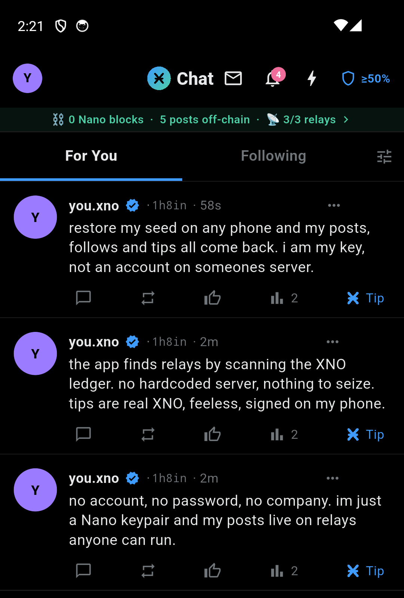

# ӾChat

**A censorship-free X (Twitter), discovered on the XNO ledger.**

You *are* a Nano keypair — no email, no password, no server account. Posts are **signed events
replicated across interchangeable relays**, and the app finds those relays by **scanning the Nano
(XNO) ledger** — so there's no hardcoded server and no directory anyone can seize. Tips are **real
XNO**, feeless, signed on your phone. The app even **updates itself over its own relays** — no app
store in the path. *(The "Ӿ" is the XNO symbol.)*

<p align="center">
  
</p>

**Try it (Android)** → [download the signed APK](apk/xchat-alpha.apk) (verify its checksum
[below](#install-the-app)), open it, allow "install unknown apps", create a wallet — **back up your
seed** — and post.  ·  **Read the design** → [`docs/WHITEPAPER.md`](docs/WHITEPAPER.md).

**Why it's different** — every load-bearing part can be routed around:

- 🔑 **Identity is a keypair, not an account.** Restore your seed on any phone and your posts, follows and tips return. The seed never leaves the device; no server API even accepts one.
- 📡 **Content is signed events on *plural* relays.** A relay verifies nothing and can only *fail to serve* — never forge or silently delete. Kill one mid-scroll and the feed is intact.
- 🛰️ **Discovery is on-ledger.** Relays self-announce on XNO; the app finds them by scanning keyless, plural rendezvous accounts. No relay URL is hardcoded — [verify it yourself](#verify-discovery-yourself).
- ⚡ **Money is Nano.** Only tips touch the chain — batched, feeless, non-custodial, signed on-device. A billion posts cost zero ledger growth.
- 📦 **Self-delivering.** Updates are signed, content-addressed, pinned across the relays, and hash-verified on-device before an explicit-tap install.

> **Alpha, on mainnet.** Research software — it moves no money on your behalf; you hold your keys.
> Only tip amounts you can afford to lose, and **back up your wallet seed** (it is the *only*
> recovery). Android-only today; one small hosted node + a couple of relays, so expect rough edges.
> See [§11 of the whitepaper](docs/WHITEPAPER.md) for an honest done-vs-building breakdown.

---

## What's in here

| Path | What it is |
|------|------------|
| `app/` | The Flutter app (Android/iOS one codebase) — full source, and the on-device signer in `lib/wallet.dart` |
| `backend/` | The node: `kt_server.py` + the helper programs it runs. **Pure Python, any OS** |
| `relay/` | `xc_relayd.py` — a relay. Pure Python, run one yourself |
| `apk/` | Pre-built signed Android APK + checksums |
| `docs/` | Whitepaper, and the working plans — [privacy & decentralization](docs/PRIVACY-AND-DECENTRALIZATION.md), [anonymity](docs/ANONYMITY.md), [push & production](docs/PUSH-AND-PRODUCTION.md), [speed & gaps](docs/SPEED-AND-GAPS.md) |
| `test/` | The interop and end-to-end tests behind the "your seed never leaves" claim |

## Install the app

Download `apk/xchat-alpha.apk` (**v2.5.4**) onto an Android phone and open it (allow "install from
this source" once). **Verify it first:**

```
sha256sum xchat-alpha.apk
# expected: 29c3f0ff741033ded31baa1b73d49d9686486d5b194f382376d1341c9bd15359
```

Signing certificate SHA-256: `d3c83e1a08edc6339a95489bce6cd017e10c921272af15429aa07a9919b7788e`
(every published update is signed by this same key, so once installed the app updates **in place**).
(`apksigner verify --print-certs xchat-alpha.apk`). Android only installs an update over an app
signed by the same certificate, so this fingerprint is what ties every future release to this one.

On first launch, **Create a new wallet** (write down the seed — it *is* your account) or restore
an existing seed — and you're on the network. Out of the box the app connects to a **hosted alpha
node** (`https://xchat-alpha-node.fly.dev`, reading **mainnet** for discovery) so you can try it
immediately; to be fully self-sovereign, **run your own node** (below) and repoint in
**Settings → Connection**. Once updates land in-app, the app re-verifies each release's SHA-256
on-device before installing — no app store in the trust path.

## Run your own node (recommended — this is the decentralized path)

The node holds **no seed and no identity**: it verifies signatures the app made, adds proof-of-work,
relays bytes, and reads the ledger. It's **pure Python and runs on any OS** — no build step.

```bash
cd backend
pip install -r requirements.txt                 # nanopy (Nano crypto) + pynacl (DM encryption)
export XC_NANO_RPC=https://rpc.nano.to          # scan the REAL XNO ledger for relays
python3 kt_server.py 8790                       # serves on 0.0.0.0:8790
```

Then in the app, **Settings → Connection → Endpoint** → `http://<your-node-host>:8790`.
Signature *verification*, block hashing and address handling are done in-process with `nanopy`
(ed25519-blake2b) — nothing to compile, nothing platform-specific. *Signing* happens only in the
app, so pointing at somebody else's node costs you nothing: it cannot post as you or spend for you.

**Host it publicly** — `deploy/` has a `Dockerfile` + `fly.toml` + `entrypoint.sh` that bundle the
node + a relay + IPFS into one image (`fly deploy`). The reference hosted node runs exactly this.

## Run your own relay

A relay is pure Python and stores only signed bytes — it holds no seed, verifies signatures, and can
only *fail to serve*, never forge. Running one **adds capacity to the network**: the app discovers
relays on-chain and through peer gossip, then spreads posts, pins, DMs and updates across all of
them. More relays = more places every load-bearing part can be routed around.

**The one-command way** (macOS/Linux) — for anyone who'd rather not think about any of the below:

```bash
curl -fsSL https://xchat-alpha-node.fly.dev/relay.sh | sh
```

[`relay/install-relay.sh`](relay/install-relay.sh) installs into `~/.xchat-relay`, makes it reachable
from the internet, and registers it to start at login (launchd / systemd `--user`). With **no flag it
auto-promotes**: a box with a **public IP becomes a hub** (binds straight to the internet, no external
service); a box **behind NAT becomes a public mesh node** (reachable through other xchat hubs, no
external service). The same URL serves the script as plain text, so read it first. `--status` shows
what's running and the public URL; `--update` upgrades in place; `--uninstall` removes everything.

### Ways to go public

Pick one; each is a full command (`sh install-relay.sh <flag>`). "App auto-uses it" means the app
picks it up automatically — the app only auto-lists **`https`** relays, so plain-HTTP modes must be
announced on-chain or pointed at by hand.

| Flag | What you get | External service | App auto-uses it |
|------|--------------|------------------|------------------|
| *(none)* | Auto: public IP → hub, behind NAT → public mesh node | None | ✅ (as applicable) |
| `--hub [addr]` | **Your own public IP/host** — binds direct, announces `http://<ip>:PORT`. The zero-dependency way to run a public hub that fronts NAT'd relays. Open the port in your firewall. | None | ⚠️ HTTP — announce it or add it manually |
| `--mesh-tunnel` | **No external service and no single point of failure.** Discovers public xchat hubs and is reachable through *all of them at once*; kill one, the others carry it. Private-by-secret. | None | Secret-only |
| `--mesh-tunnel --public` | Same, but hubs **list** it so every app auto-discovers it with no secret. Reached as `<hub>/r/<token>`, so its own IP is never exposed. | None | ✅ |
| `--tailscale` | Free **permanent** address via Tailscale Funnel (`tailscale up` + enable Funnel first) | Tailscale | ✅ |
| `--localhost-run` | Free SSH reverse tunnel → short `*.lhr.life` name, no account, no Cloudflare. Register the printed key for a name that never changes. Needs `ssh`. | localhost.run | ✅ |
| `--quick` | Free Cloudflare quick tunnel. Needs nothing, but the hostname **changes every restart** (can't be announced) and rate-limits. | Cloudflare | ✅ (until restart) |
| `--domain relay.example.com` | You already route that name to this machine (reverse proxy / existing tunnel) | your setup | ✅ |
| `--domain … --tunnel-token TOKEN` | **Most reliable** — your own domain over a *named* Cloudflare tunnel. Stable name, unlimited bandwidth. | Cloudflare | ✅ |
| `--setup-worker` | Free permanent `*.workers.dev` front for a quick-tunnel node, so the published address never changes | Cloudflare | ✅ |

> **`--mesh-tunnel` does not give apps a direct connection.** A mesh node has no public address of
> its own — it dials *out* to public hubs, and apps reach it *through* them at `<hub>/r/<token>/…`.
> The hub reverse-proxies the request down the tunnel; the node's IP is never exposed, and routing is
> by an opaque token so even the hub carrying the traffic can't tell whose relay it is. For apps to
> connect **straight to the box's own address**, use `--hub` (direct IP) or an HTTPS mode
> (`--domain` / `--tailscale` / `--quick`).

The relay binds to `127.0.0.1` only unless it's a `--hub` (which listens on `0.0.0.0` by design) — for
tunnel modes, the tunnel is the sole way in.

### A relay's identity is its keypair, not its URL

A quick tunnel's hostname changes on every restart, so **a relay's identity is its own keypair**. Each
relay generates one on first run (kept beside its state file, holds no funds) and signs
`relay_announce` records binding *account → current url*. Peers key on the account, so a relay that
comes back at a new address **replaces** its old entry instead of leaving a dead one behind, and
because the record is signed it can be gossiped on by any peer without that peer being able to alter
the URL. Relays also re-probe what they know and forget a URL after `XC_RELAY_FAIL_MAX` consecutive
failures — so address churn is self-healing rather than cumulative. Relays that predate this still
interoperate: `/relays` keeps its flat url list and unsigned announces are accepted as before.

### Be findable (announce on-chain)

Being *reachable* isn't the same as being *findable*. To be discovered by people who don't already
have your URL, announce the relay on the XNO ledger — this needs a **permanent** address (32 chars or
fewer) and a signing key. The installer sets both up, one command each, and never touches your seed:

```bash
sh ~/.xchat-relay/install-relay.sh --setup-worker    # free permanent workers.dev address
sh ~/.xchat-relay/install-relay.sh --setup-operator  # create the signing key + what to fund it with
```

The announce spends a few *raw* (dust); the account just has to exist on-chain. From then on any node
scanning the ledger finds your relay automatically — no coordination, no registration server. A
`--public` mesh node skips even this: it's auto-discovered through the hubs with no ledger entry.

### By hand

If you want the pieces where you can see them:

```bash
cd relay
python3 xc_relayd.py 7401 relay-state.json      # binds 0.0.0.0:7401
```

Host it anywhere with a public URL (a small VM, Fly.io, etc.), then announce it from a funded wallet
**you** control (a real, tiny Nano transaction):

```bash
python3 backend/xc_reldir.py announce https://your-relay.example.com
```

That commits your relay's URL to your account's chain and checks in at the rendezvous accounts —
after which any node scanning the ledger finds it automatically.

## Verify discovery yourself

You don't have to trust us that discovery is on-chain:

1. Open a **rendezvous account** (printed by `python3 backend/xc_reldir.py accts`) in any Nano
   block explorer. You'll see relay accounts' dust check-ins.
2. Open a **relay account** — its latest block encodes that relay's URL.
3. That is exactly the read the node performs in `xc_common.onchain_relays()`. No hidden server.

In the app, tap the **"📡 relays"** strip to see every discovered relay with its live signal
strength and reliability, and the rendezvous it was found through.

## Run the tests

The "your seed never leaves the device" claim is the one worth checking rather than believing, so
it is what the tests are about.

```bash
cd app && flutter test                  # the wallet: derivation, canonical messages, DM sealing
python3 test/interop_test.py            # the app's Dart signatures, verified by the node's Python
python3 test/e2e_test.py                # a real relay + node, driven through the app's own signer
```

`interop_test.py` matters because the app signs with Dart (`nanodart`) and the node verifies with
Python (`nanopy`): if those disagree by one byte, every post is rejected and it looks like a network
fault. `e2e_test.py` checks each write path **twice** — that a correctly signed record is accepted
and reaches the relay, and that a tampered one is refused. (Both need `nanopy`; the e2e run also
needs `dart` on PATH and an `ipfs` daemon.)

## Security & honesty

- **Alpha quality.** Don't put anything you can't afford to lose on it.
- The app **never** sends money on your behalf; tips and any settlement are user-initiated and
  go directly wallet-to-wallet.
- **The node cannot act as you.** It holds no seed; every write is signed on the device and the
  node only verifies, adds proof-of-work, and relays. There is no API that accepts a seed.
- **The seed is held in the platform secure store** — Android EncryptedSharedPreferences (master key in
  the Android Keystore), iOS Keychain; a legacy plaintext copy is migrated in and deleted on first read.
  It isn't in readable preferences, but a rooted/compromised device running the app can still have it
  decrypted, so treat the phone as the weak point. **Recovery is *only* your seed** — a wallet is a
  random seed, so if you don't save it and the app is reinstalled, its funds are unrecoverable; backup
  is **mandatory and verified** before a fresh wallet can be used (see whitepaper §11). Note that
  *claiming* incoming XNO is deliberately **not** gated on it: the funds are already assigned to your
  account on the ledger, so refusing to pocket them protects nothing and only hides money you already
  own. The backup nag sits where you hand out your address instead.
- **In-app updates need a pinned publisher.** The update-signing key lives outside this repo
  (`xc_release.py keygen` → `~/.xchat/publisher.key`, 0600). With no publisher account pinned, the
  app refuses in-app updates rather than trusting an unknown signer.
- Network metadata is not private: no onion routing yet, so treat your IP as visible.
- The only layer that isn't censorship-free is the OS install gate (Android allows sideload/
  self-update; iOS does not) — the app tells you so.

## Roadmap

Honest list of what's known-missing, not a wish list. Each line says why it isn't done.

- **Camera QR scan.** The wallet can *show* a QR to be paid, but can't *read* one — so sending still
  means pasting a 65-character address. Needs a camera permission and a scanner dependency, and the
  permission prompt is worth designing rather than bolting on.
- **Instant receive.** Incoming XNO is claimed automatically, but an external send is only noticed by
  a 12s poll (in-app tips are event-driven and land immediately). The fix is either folding the
  receivable total into the feed response the app already fetches, or a websocket — the latter would
  mean pointing the app at a third-party Nano node, leaking your account to it and reintroducing the
  chokepoint this design avoids.
- **DM parity.** No read receipts, typing indicator, reactions, in-conversation search, voice notes
  or forwarding.
- **Tor relay-to-relay transport.** Prototyped and reverted. A v3 onion is 62 bytes and the on-chain
  link holds 32, phones have no Tor client, and a cold onion circuit measured >90s against ~1.2s warm
  — so it can never sit in a hot path. Worth revisiting if censorship becomes real rather than
  hypothetical.
- **P2P media between phones.** Parked: peers won't be paid for serving what relays already give away.

Engineering, not features:

- **Wire `./deploy/stamp-release.sh --check` into CI.** It needs no publisher key and fails when the
  in-app banner names a version other than the one being released, or has expired — the check that
  was missing while the banner sat on "2.3.9 is live" for three releases. Running it per PR turns
  that from something you notice in production into something that fails a build.

## License

Released for research and experimentation. See [`LICENSE`](LICENSE).
